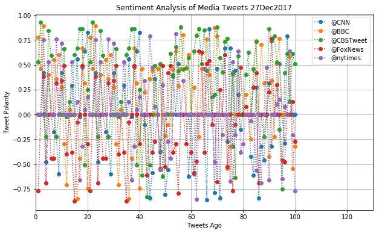
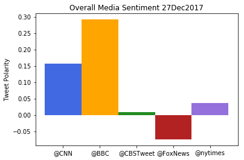

# Distinguishing Sentiments
UCB Extension HW7 written by A. Lam

# Analysis
- Observation 1: Most Neutral News Outlet of the 5: CBS
- Observation 2: Most Positive News Outlet of the 5: BBC
- Observation 3: Most Negative News Outlet of the 5: Fox

# Setup


```python
# Dependencies
!pip install vaderSentiment==2.5
import tweepy
import json
import numpy as np
import pandas as pd
import matplotlib.pyplot as plt
from time import time, strftime, gmtime
import sys
sys.path.append('/Users/alam/homework/Quarantine/Keys')
import Twit
```

    Requirement already satisfied: vaderSentiment==2.5 in /anaconda3/envs/UCBE/lib/python3.6/site-packages


```python
# Import and Initialize Sentiment Analyzer
from vaderSentiment.vaderSentiment import SentimentIntensityAnalyzer
analyzer = SentimentIntensityAnalyzer()

# Twitter API Keys
consumer_key = Twit.CKey
consumer_secret = Twit.CSecret
access_token = Twit.AToken
access_token_secret = Twit.ASecret

# Setup Tweepy API Authentication
auth = tweepy.OAuthHandler(consumer_key, consumer_secret)
auth.set_access_token(access_token, access_token_secret)
api = tweepy.API(auth, parser=tweepy.parsers.JSONParser())
```


```python
# Initialization of script structure
networks = ['@CNN','@BBC','@CBSTweet','@FoxNews', '@nytimes']
n_tweets = 100
n_pages = int(round(n_tweets/20,0))
output = pd.DataFrame({'User' : [],
            'Tweet': [],
            'TweetsAgo': [],           
            'Compound Score' : [],
            'Positive Score' : [],
            'Neutral Score' : [],
            'Negative Score' : []})

# script execution
for network in networks:
    target_user = network
    counter = 0
    for i in range(n_pages):
        public_tweets = api.user_timeline(target_user, page = i)
        for tweet in public_tweets:
            counter += 1
            target_string = tweet['text']
            compound = analyzer.polarity_scores(target_string)["compound"]
            pos = analyzer.polarity_scores(target_string)["pos"]
            neu = analyzer.polarity_scores(target_string)["neu"]
            neg = analyzer.polarity_scores(target_string)["neg"]
            this_output = pd.DataFrame({
                'User': target_user,
                'Tweet': target_string,
                'TweetsAgo': counter, 
                'Compound Score' : compound,
                'Positive Score' : pos,
                'Neutral Score' : neu,
                'Negative Score' : neg
            },index=[counter])
            output = output.append(this_output)
            if counter == n_tweets:
                break
```


```python
output.tail()
```


<div>
<style>
    .dataframe thead tr:only-child th {
        text-align: right;
    }

    .dataframe thead th {
        text-align: left;
    }

    .dataframe tbody tr th {
        vertical-align: top;
    }
</style>
<table border="1" class="dataframe">
  <thead>
    <tr style="text-align: right;">
      <th></th>
      <th>Compound Score</th>
      <th>Negative Score</th>
      <th>Neutral Score</th>
      <th>Positive Score</th>
      <th>Tweet</th>
      <th>TweetsAgo</th>
      <th>User</th>
    </tr>
  </thead>
  <tbody>
    <tr>
      <th>96</th>
      <td>0.0772</td>
      <td>0.000</td>
      <td>0.929</td>
      <td>0.071</td>
      <td>New research challenges the deeply held notion...</td>
      <td>96.0</td>
      <td>@nytimes</td>
    </tr>
    <tr>
      <th>97</th>
      <td>0.0000</td>
      <td>0.000</td>
      <td>1.000</td>
      <td>0.000</td>
      <td>The Philippines is phasing out its most widely...</td>
      <td>97.0</td>
      <td>@nytimes</td>
    </tr>
    <tr>
      <th>98</th>
      <td>0.6369</td>
      <td>0.000</td>
      <td>0.634</td>
      <td>0.366</td>
      <td>What are some good TV romances? @margeincharge...</td>
      <td>98.0</td>
      <td>@nytimes</td>
    </tr>
    <tr>
      <th>99</th>
      <td>-0.2023</td>
      <td>0.141</td>
      <td>0.859</td>
      <td>0.000</td>
      <td>Why Lebanon’s prime minister had that strange ...</td>
      <td>99.0</td>
      <td>@nytimes</td>
    </tr>
    <tr>
      <th>100</th>
      <td>-0.7717</td>
      <td>0.330</td>
      <td>0.549</td>
      <td>0.121</td>
      <td>RT @nytopinion: No matter what Mueller finds, ...</td>
      <td>100.0</td>
      <td>@nytimes</td>
    </tr>
  </tbody>
</table>
</div>


```python
output.groupby(['User']).mean()
```


<div>
<style>
    .dataframe thead tr:only-child th {
        text-align: right;
    }

    .dataframe thead th {
        text-align: left;
    }

    .dataframe tbody tr th {
        vertical-align: top;
    }
</style>
<table border="1" class="dataframe">
  <thead>
    <tr style="text-align: right;">
      <th></th>
      <th>Compound Score</th>
      <th>Negative Score</th>
      <th>Neutral Score</th>
      <th>Positive Score</th>
      <th>TweetsAgo</th>
    </tr>
    <tr>
      <th>User</th>
      <th></th>
      <th></th>
      <th></th>
      <th></th>
      <th></th>
    </tr>
  </thead>
  <tbody>
    <tr>
      <th>@BBC</th>
      <td>0.157315</td>
      <td>0.04548</td>
      <td>0.84451</td>
      <td>0.11000</td>
      <td>50.5</td>
    </tr>
    <tr>
      <th>@CBSTweet</th>
      <td>0.291349</td>
      <td>0.03824</td>
      <td>0.81148</td>
      <td>0.15028</td>
      <td>50.5</td>
    </tr>
    <tr>
      <th>@CNN</th>
      <td>0.008613</td>
      <td>0.06575</td>
      <td>0.85607</td>
      <td>0.07815</td>
      <td>50.5</td>
    </tr>
    <tr>
      <th>@FoxNews</th>
      <td>-0.074605</td>
      <td>0.09710</td>
      <td>0.84243</td>
      <td>0.06049</td>
      <td>50.5</td>
    </tr>
    <tr>
      <th>@nytimes</th>
      <td>0.035665</td>
      <td>0.05316</td>
      <td>0.87847</td>
      <td>0.06835</td>
      <td>50.5</td>
    </tr>
  </tbody>
</table>
</div>


# Save Tweets to File


```python
# Print output to File
output.to_csv('NewsOutletTweets_' + strftime('%d%b%Y', gmtime()) + '.csv',index = False)
```

# Plot Tweet Polarity


```python
users = output['User'].unique()
padding = 30
colors = ['b','g','r','c','y']

plt.figure(figsize = [10,6])
for user in users:
    tweets = output.loc[output['User'] == user]
    plt.plot(tweets['TweetsAgo'],tweets['Compound Score'],'o:', label = user)
plt.xlim([0,n_tweets + padding])
plt.xlabel('Tweets Ago')
plt.ylabel('Tweet Polarity')
plt.title('Sentiment Analysis of Media Tweets %s' % strftime('%d%b%Y', gmtime()))
plt.legend(loc = 'upper right')
plt.grid(True)
plt.savefig('SentimentAnalysis%s.png' % strftime('%d%b%Y', gmtime()))
plt.show()
```





```python
plt.bar(np.arange(len(users)),output.groupby(['User'])['Compound Score'].mean(),
        color = ['royalblue','orange','forestgreen','firebrick','mediumpurple'], width= 1)
plt.xticks(np.arange(len(users)),users)
plt.ylabel('Tweet Polarity')
plt.title('Overall Media Sentiment %s' % strftime('%d%b%Y', gmtime()))
plt.savefig('OverallSentiment%s.png' % strftime('%d%b%Y', gmtime()))
plt.show()
```




